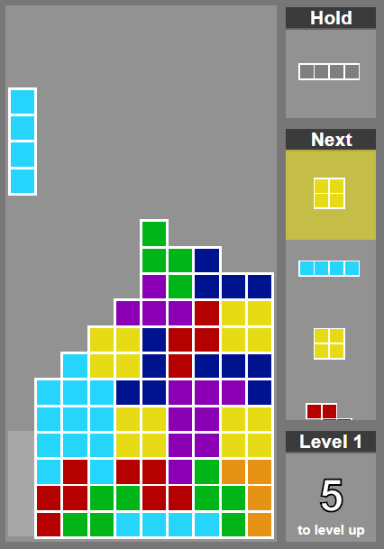

# Four Squares

Javascript implementation of the classic game Tetris &reg; &amp; &copy;

## Keyboard controls

- <kbd>&larr;</kbd> &amp; <kbd>&rarr;</kbd>: move piece

- <kbd>&darr;</kbd>: move down

- <kbd>Space</kbd>: snap down

- <kbd>W</kbd>: rotate piece counter clockwise

- <kbd>&uarr;</kbd>: rotate piece counter clockwise

- <kbd>Shift</kbd>: hold piece

## Touch screen controls

- swipe left / right: move piece

- swipe down &amp; hold: move down

- swipe down quickly: snap down

- tap left side of screen: rotate piece counter clockwise

- tap right side of screen: rotate piece clockwise